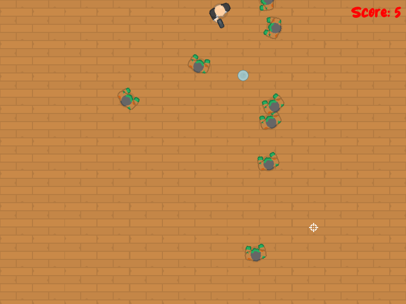

# Top Down Shooter Qt

Top Down Shooter is an engaging and fast-paced 2D shooting game developed using the Qt framework. In this game, players navigate a character from a top-down perspective, aiming to defeat waves of enemies and achieve high scores. The game features smooth controls, dynamic gameplay, and visually appealing graphics.

## Screenshots

## Addons
* [Qt](https://www.qt.io/) - Cross-Platform software for embedded & desktop
* [Font](https://www.dafont.com/juniory.font) - font
* [Tiles/Images](https://kenney.nl) - kenney.nl
* [Github repo](https://github.com/challacade/udemy-love2d/tree/master/TopDownShooter) - inspiration
* [youtube](https://youtu.be/YuSc8oCXHxk) - gameplay
